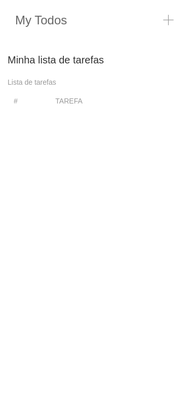
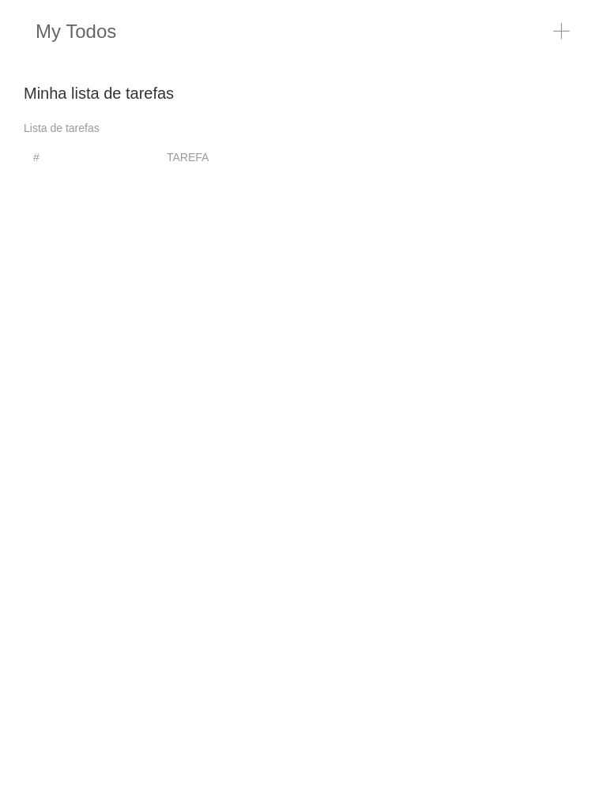
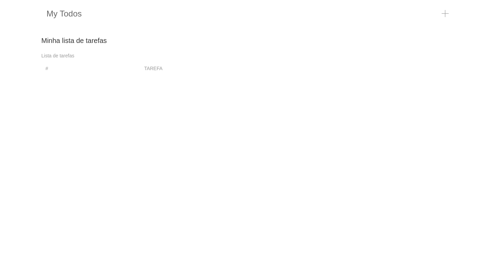

<p align="center">
  <image height="20px"
  src="https://img.shields.io/github/repo-size/JCDMeira/to-do-app?style=for-the-badge"
  />
  <image
  src="https://img.shields.io/github/languages/count/JCDMeira/to-do-app"
  />
  <image
  src="https://img.shields.io/github/languages/top/JCDMeira/to-do-app"
  />
  <image
  src="https://img.shields.io/github/last-commit/JCDMeira/to-do-app"
  />
  <image
  src="https://img.shields.io/github/watchers/JCDMeira/to-do-app?style=social"
  />
</p>

# 📋 Indíce

- [Proposta](#id01)
  <!-- - [O desafio](#id01.1)
    - [Requisitos não funcionais ](#id01.1.1)
    - [Requisitos não obrigatórios](#id01.1.2) -->
- [Screenshots](#id02)
- [Links](#id03)
  - [Recursos úteis](#id03.1)
- [Feito com](#id04)
  - [O que aprendi](#id04.1)
- [Pré-requisitos](#id05)
- [Procedimentos de instalação](#id06)
- [Autor](#id07)

# 🚀 Proposta <a name="id01"></a>

Criar uma aplicação com React e TypeScrip para permitir o gerenciamento de to-dos.

<!-- ## :trophy: O desafio <a name="id01.1"></a>

### :dart: Requisitos não funcionais <a name="id01.1.1"></a>


### :pushpin: Requisitos não obrigatórios <a name="id01.1.2"></a>-->

# :camera_flash: Screenshots <a name="id02"></a>

<br />

## :iphone: Mobile design

<p  align="center">
  </img>
</p>

## :iphone: Tablets design

<p  align="center"></img></p>

## :desktop_computer: Desktop design

<p  align="center"></img></p>

## :chart_with_upwards_trend: result of my work

<p  align="center"></img></p>

<br />

# :heavy_check_mark: Links <a name="id03"></a>

<br />

- Live Site URL: [check the result](https://jcdmeira-to-do.netlify.app)

<br />

## Recursos úteis <a name="id03.1"></a>

- [Tutorial de react](https://pt-br.reactjs.org/tutorial/tutorial.html)
- [Conversor de unidades CSS - px para VH/VW/REM](https://it-news.pw/pxtovh/)
- [upgrading react-router-dom](https://reactrouter.com/docs/en/v6/upgrading/v5)
- [useForm](https://react-hook-form.com/api/useform)

# 🛠 Feito com <a name="id04"></a>

- [React](https://reactjs.org/)
- [TypeScript](https://www.typescriptlang.org)

## O que eu aprendi <a name="id04.1"></a>

Aprendi um pouco mais sobre desacoplamento e como é possível dividir e separar certas responsabilidades em um arquivo a parte. Para se necessário fazer alterações é possível fazer apenas no arquivo em questão.

Como no exemplo a seguir, em que todo o acesso ao localStorage fica consentrado em TodoService.tsx na pasta services.

```tsx
import { Todo } from '../models/Todo';

const TODO_STORE = 'myTodos';

export const get = (): Todo[] => {
  const data = localStorage.getItem(TODO_STORE) || '';
  try {
    const result = JSON.parse(data) as Todo[];
    return result;
  } catch {
    return [];
  }
};

export const save = (data: Todo[]) => {
  if (data?.length >= 1) {
    localStorage.setItem(TODO_STORE, JSON.stringify(data));
  }
  if (data?.length === 0) {
    localStorage.setItem(TODO_STORE, '');
  }
};
```

Outro exemplo é isolar a tipagem usada em context em um arquivo a parte, sendo construida como uma interface em um arquivo isolado.

```tsx
/* eslint-disable no-unused-vars */
import { Todo } from '../models/Todo';

export interface TodoContextType {
  todos: Todo[];
  addTodo(title: string): void;
  removeTodo(todo: Todo): void;
  toggle(todo: Todo): void;
}
```

O mesmo foi feito com o Todo citado acima como "todo: Todo[]", onde Todo é uma classe isolada como um arquivo dentro de models.

```tsx
export class Todo {
  constructor(public id: number, public title: string, public done: boolean) {}
}
```

# ☑️ Pré-requisitos <a name="id05"></a>

<br />

- [x] Editor de código de sua preferência (recomendado VS code)
- [x] Git
- [x] Gerenciador de pacotes Yarn ou NPM

<br />

# 📝 Procedimentos de instalação <a name="id06"></a>

<br />

Clone este repositório usando o comando:

```bash
git clone https://github.com/JCDMeira/to-do-app.git
```

Na pasta do projeto instale as dependências com uso do npm ou yarn

```bash
npm install

ou

yarn install
```

Para iniciar o servidor é só usar o comando

```
yarn start

ou

npm start

```

<br />

# :sunglasses: Autor <a name="id07"></a>

<br />

- Linkedin - [jeanmeira](https://www.linkedin.com/in/jeanmeira/)
- Instagram - [@jean.meira10](https://www.instagram.com/jean.meira10/)
- GitHub - [JCDMeira](https://github.com/JCDMeira)
